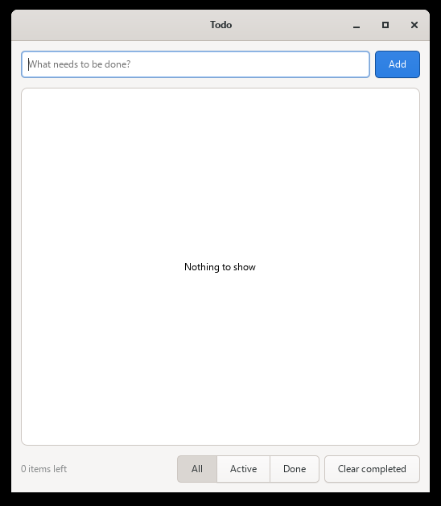

# gotk4 Todo: a GTK 4 desktop app in Go

A small **todo app** written in **Go** with **GTK 4**, using the [gotk4](https://github.com/diamondburned/gotk4) bindings, built and run on **Windows**.

> 📚 **This is a learning project.** It shows end to end how to build, run and ship a GTK 4 app written in Go on Windows.
> It's meant to be used as a **template for your future GTK apps in Go**: copy it, swap in your own UI, and keep the build setup.



## Features

- Add tasks (Enter or **Add**), mark them done, delete them
- Filter by **All / Active / Done**, "N items left" counter, **Clear completed**
- In-memory only: no database, nothing is saved yet

## How it's built

| Piece | Used for |
|---|---|
| **Go** 1.25 | the app (`main.go`) |
| **gotk4** v0.4.1 | Go bindings for GTK 4 (uses cgo) |
| **[MSYS2](https://www.msys2.org/)** (UCRT64 environment) | provides GTK 4.24, gcc and pkg-config on Windows |

msys2 packages installed (in the **MSYS2 UCRT64** terminal):

```sh
pacman -Syu
pacman -S --needed mingw-w64-ucrt-x86_64-gcc mingw-w64-ucrt-x86_64-pkgconf \
  mingw-w64-ucrt-x86_64-gtk4 mingw-w64-ucrt-x86_64-gobject-introspection \
  mingw-w64-ucrt-x86_64-make
```

`C:\msys64\ucrt64\bin` is added to the user `PATH`, so gcc and the GTK DLLs can be found from any terminal.

## Quick start

```powershell
.\build.ps1 run      # build todo.exe and start it
.\package.ps1        # build a self-contained dist\ folder to share
```

| Script | What it does |
|---|---|
| `build.ps1` | Builds `todo.exe` with msys2's gcc and pkg-config (`.\build.ps1 run` also starts it) |
| `run.ps1` | Starts `todo.exe` with msys2's DLL folder on `PATH` (for machines where it isn't on `PATH`) |
| `package.ps1` | Bundles the exe with the GTK DLLs, icons and data into `dist\`, which runs on any Windows PC without msys2 |

The same is available through make: `mingw32-make build | run | package | clean | help`.

> The first build takes several minutes (gotk4 compiles a lot of C code through cgo). After that, builds take seconds.

## Using it as a template

1. Copy the project and change the module name in `go.mod`.
2. Change `appID` in `main.go` to your own reverse-DNS ID (e.g. `com.yourname.yourapp`).
3. Replace the UI in `main.go` with your own.
4. If you rename the binary, update `todo.exe` in `build.ps1`, `run.ps1`, `package.ps1` and `.gitignore`.

## Roadmap

- [x] GTK 4 todo app in Go (gotk4)
- [x] Windows build with msys2 (UCRT64)
- [x] Self-contained Windows bundle (`dist\`)
- [x] `make` shortcuts for the scripts
- [x] Developer docs ([DEV_DOCS.md](DEV_DOCS.md))
- [ ] **Linux** template: build with the distro's GTK 4 packages (`apt`, `dnf`, `pacman`), shell-script equivalents of the `.ps1` scripts
- [ ] Linux packaging (AppImage or Flatpak)
- [ ] **macOS** template: build with Homebrew's GTK 4
- [ ] macOS packaging (`.app` bundle with the GTK libraries)
- [ ] One cross-platform build entry point (Makefile/Taskfile targets that work on Windows, Linux and macOS)
- [ ] CI builds for all three platforms (GitHub Actions)
- [ ] Optional: saving todos to disk

## More details

📖 **For the full guide, read [DEV_DOCS.md](DEV_DOCS.md).**
It covers how GTK on Windows works, setup from scratch, PATH and DLLs, gotk4, every script line by line, the `dist` bundle, how the code works, and troubleshooting.

See also [MSYS2-ENVIRONMENTS.md](MSYS2-ENVIRONMENTS.md): which msys2 terminal to use, and which packages to install for make, cmake, g++ and more.
